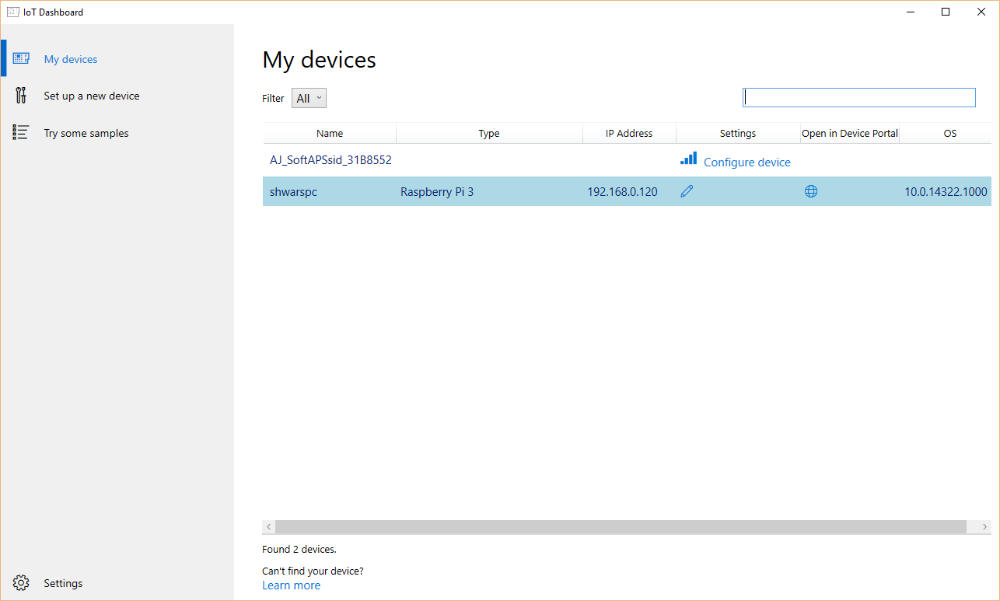
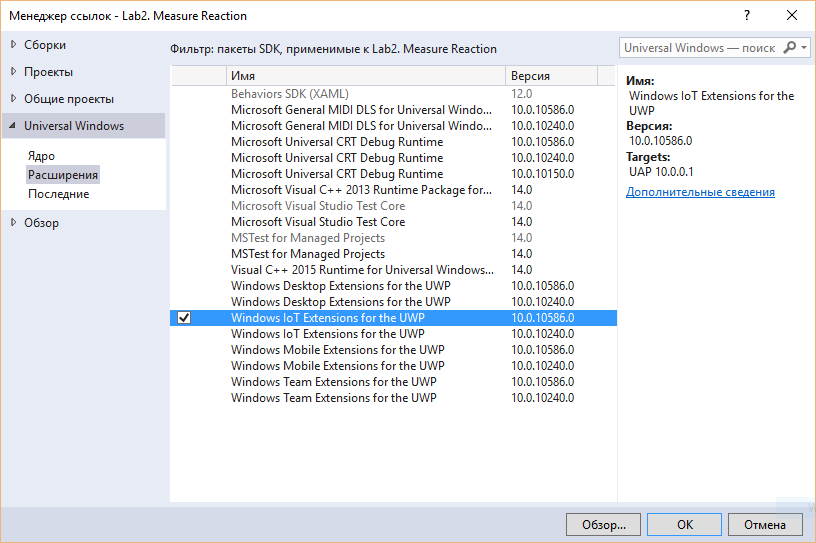
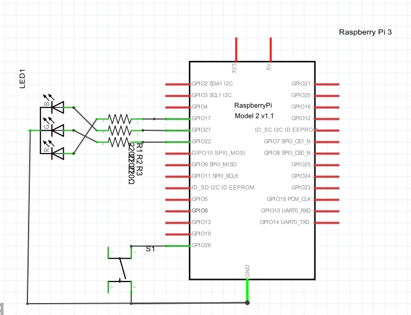

#DevCon 2016: IoT-интенсив 

# Лабораторная 1: Настройка окружения и продвинутое мигание

## Настройка платы Raspberry Pi 3

Вставьте в плату карту Micro SD, подключите к карте проводной Ethernet и воткните питание через кабель MicroUSB в компьютер. 
Подождите, пока плата загрузится. Процесс можно контролировать через подключенный HDMI-монитор.

После загрузки запустите на своём компьютере **IoT Dashboard**. В нём вы должны увидеть свою плату. Если плат будет много, то выбрать свою можно по IP-адресу
(он также отображается на мониторе после загрузки платы).



Рекомендуется для начала изменить основные настройки платы, нажав на иконку с карандашиком:

 * Изменить название платы по умолчанию (**minwinpc**) на что-то более осмысленное для вас
 * Изменить стандартный пароль по умолчанию (**p@ssw0rd**) на в меру секретный пароль

После внесения изменений плата будет перезагружена.

Для внесения более подробных изменений в конфигурацию платы вы можете поключиться к плате через веб-интерфейс, нажав значек земного шарика напротив вашей платы 
в IoT Dashboard, или введя в браузере адрес http://<IP Address>:8080. При этом надо будет ввести имя пользователя Administrator и выбранный вами пароль 
(или p@ssword по умолчанию). Через этот же интерфейс всегда можно сделать плате shutdown (рекомендуется это делать перед выдергиванием питания во избежание проблем).

Опционально возможно также настроить WiFi адаптер для доступа к WiFi-сети интенсива, чтобы освободиться от проводного подключения.

## Создаем универсальное приложение

После этого мы можем создать новый проект пустого универсального IoT-приложения в Visual Studio 2015. Если всё сделано правильно, 
то в верхней панели вы можете выбать ARM как целевую архитекруту и "Удалённый комьютер", чтобы запустить приложение на плате Raspberry Pi.

Чтобы использовать специфические возможности платы, такие, как управление пинами ввода-вывода, необходимо подключить расширения для IoT, выбрав
"Добавить ссылку -> Платформа UWP -> Расширения -> IoT Extensions":



## Подключаем светодиод

Для выполнения задания нам необходимо подключить к контроллеру светодиод, с использованием специальной макетной платы. Плата Raspberry Pi содержит некоторое количество
входов-выходов общего назначения (т.н. Gpio), которые нам нужны.


Для включения светодиода, нам нужно собрать на плате следующую принципиальную схему. Помимо светодиода, она содержит также и выключатель, который
нам пригодится впоследствии.



В собранном виде на макетной плате наша схема будет выглядеть так:


## Управляем светодиодом

Для управления светодиодом необходимо устанавливать соответствующие выводы (пины) контроллера в высокое или низкое состояние. Для работы с пинами используется
класс GpioController, следующим образом:

```
   var Gpio = GpioController.GetDefault();
   var pin = Gpio.OpenPin(17);
   pin.SetDriveMode(GpioPinDriveMode.Output);
   pin.Write(GpioPinValue.Low);
```
