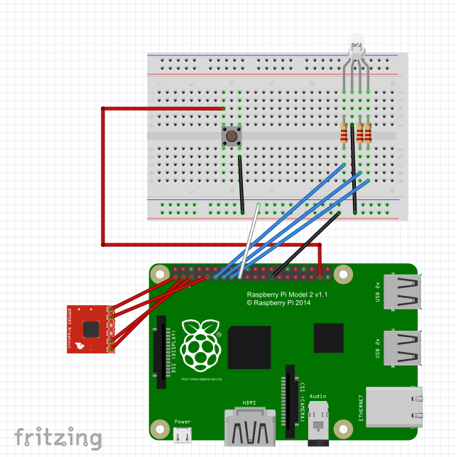
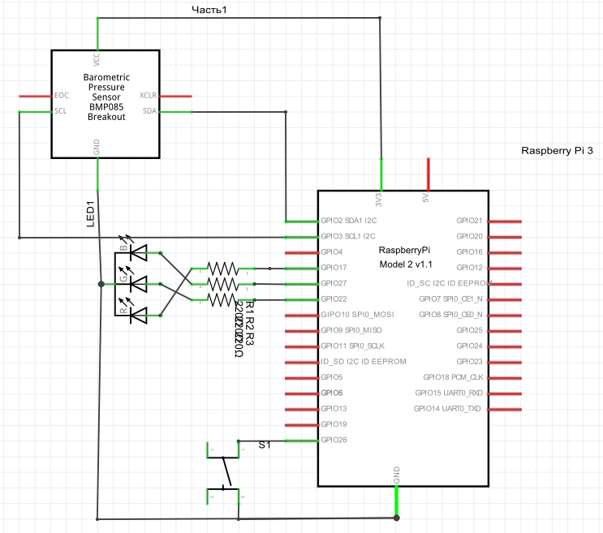

#DevCon 2016: IoT-интенсив 

# Лабораторная 3: Собираем погодную станцию

В этой лабораторной работе мы с вами научимся измерять температуру и давление при помощи датчика BMP-180, подключаемого по интерфейсу I2C.
Для подключения необходимо использовать 4 провода - питание (3.3В), земля (GND), и два провода с сигналами: SDA и SCL. Подключите датчик
непосредственно к контроллеру (сохранив предыдущую схему со светодиодом), как показано на рисунке:



Принципиальная схема будет выглядеть следующим образом:



## Получаем температуру с датчика

Для получения температуры с датчика необходимо использовать специальный код для работы с I2C-устройствами, и затем декодировать пришедшие
параметры для получения температуры. Для работы с датчиком мы приготовили для вас готовый класс: скопируйте всю директорию [Devices](https://github.com/evangelism/DevCon-2016/tree/master/IoT%20intensive/Lab3.%20Measure%20Temp/Lab3.%20Measure%20Temp/Devices)
в ваш проект. Там заодно содержится класс `MultiLED`, позволяющий более просто работать с трехцветным светодиодом.

Теперь для получения температуры достаточно написать:
```
Sens = new BMP180();
await Sens.Init();
...
var t = Sens.Temperature;
```

# Задание

Реализуйте универсальное приложение (его можно сделать на основе реализованного вами приложения мерцания светодиода), которое:

 1. Каждую секунду выводит на экран обновленную температуру
 2. В зависимости от температуры, зажигает светодид различными цветами (ниже 25С, 25С-30С, выше 30С).
 3. [ADVANCED] Выводит на экран график температуры от времени.
