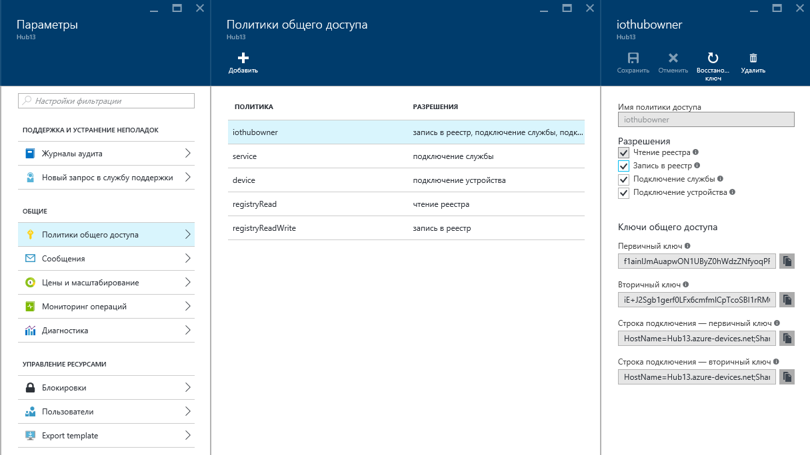

#Lab 4: Посылаем погоду в облако

## Создаём IoT Hub в облаке



## Получаем код для работы с IoT-хабом

Очень хорошая страничка [Getting Started](https://azure.microsoft.com/ru-ru/develop/iot/get-started/) есть в MSDN. 
Выбираете своё устройство, язык программирования и т.д. - и получаете фрагмент кода.

В нашем случае выбираем Raspberry Pi 2 -> Windows -> C#. При добавлении кода в проект, необходимо также добавить ссылку на NuGet-пакет
`Microsoft.Azure.Devices.Client`.


## Настраиваем Stream Analytics

Для начала, настроим Stream Analytics для передачи данных из IoT Hub в PowerBI. Заодно можно осуществить усреднение данных по температуре за какой-то интервал времени,
например, 5 секунд.

Для этого используем такой запрос:

```
SELECT
    Id, AVG(Temperature) as Temp, [Table], No, 
    MAX(Time) as EndTime, MIN(Time) as BeginTime
INTO [OutBI]
FROM [InHub] TIMESTAMP BY Time
GROUP BY Id,[Table],No,TumblingWindow(Duration(second,5))
```

Вам может пригодится [прекрасный документ с набором примеров запросов](https://azure.microsoft.com/en-us/documentation/articles/stream-analytics-stream-analytics-query-patterns/).


