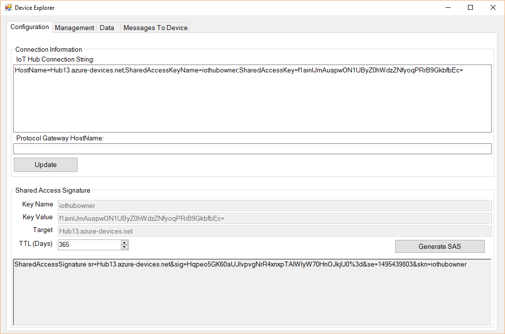
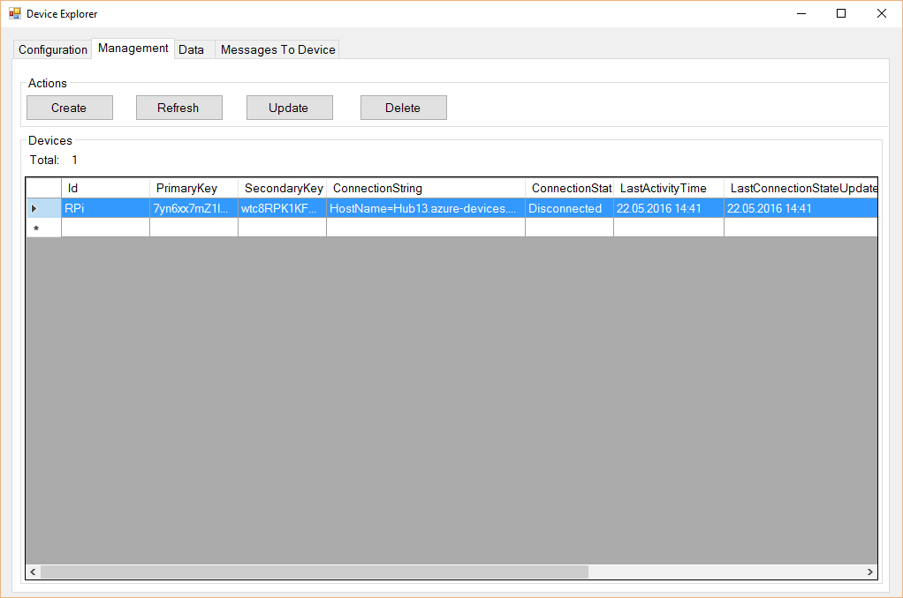

#Lab 4: Посылаем погоду в облако

## Создаём IoT Hub в облаке

Для начала создаем в облаке свой IoT Hub (раздел "Интернет вещей"). После создания хаба скопируйте строку подключения:


## Подключаемся к IoT-хабу и создаем строку подключения для устройства

Используйте и установите [Device Explorer](https://github.com/Azure/azure-iot-sdks/blob/master/tools/DeviceExplorer/doc/how_to_use_device_explorer.md). В нем введите
строку подключения к IoT-хабу:



После этого перейдите на вкладку "Management" и добавьте новое устройство. Затем правой кнопкой нажмите на строку с устройством и выберите "Copy Connection String".



## Получаем код для работы с IoT-хабом

Очень хорошая страничка [Getting Started](https://azure.microsoft.com/ru-ru/develop/iot/get-started/) есть в MSDN. 
Выбираете своё устройство, язык программирования и т.д. - и получаете фрагмент кода.

В нашем случае выбираем Raspberry Pi 2 -> Windows -> C#. При добавлении кода в проект, необходимо также добавить ссылку на NuGet-пакет
`Microsoft.Azure.Devices.Client`. В полученном коде не забудьте исправить строку подключения на ту, которая была получена на предыдущем шаге.

### Отправка данных в IoT Hub

Для отправки данных используется следующий код:

```
iothub = DeviceClient.CreateFromConnectionString(DeviceConnectionString);
await iothub.OpenAsync();
...
var d = new TempData("RPi", t, Table, No);
var s = Newtonsoft.Json.JsonConvert.SerializeObject(d);
var b = Encoding.UTF8.GetBytes(s);
await iothub.SendEventAsync(new Message(b));
```
Здесь используется библиотека `Newtonsoft.Json` (которую надо установить через Nuget) и тип для представления данных об одном температурном измерении:

```
    public class TempData
    {
        public string Id { get; set; }
        public double Temperature { get; set; }
        public DateTime Time { get; set; }
        public int Table { get; set; }
        public int No { get; set; }
        public TempData(string id, double Temp, int Table, int No)
        {
            Time = DateTime.Now;
            Temperature = Temp;
            Id = id;
            this.Table = Table;
            this.No = No;
        }
    }
```

### Принимаем данные из IoT Hub
Для приёма сообщений из IoT Hub можно использовать следующий код:
```
        private async Task Receive()
        {
            while (true)
            {
                var msg = await iothub.ReceiveAsync();
                if (msg != null)
                {
                    var s = Encoding.ASCII.GetString(msg.GetBytes());
                    // Сделать что-то с полученным сообщением, например, зажечь светодиод
                    LED.SetInt(int.Parse(s));
                    await iothub.CompleteAsync(msg);
                }
            }
        }
```

## Настраиваем Stream Analytics

Для передачи данных из IoT Hub в систему хранения можно использовать Stream Analytics.

Для начала, настроим Stream Analytics для передачи данных из IoT Hub в PowerBI. Заодно можно осуществить усреднение данных по температуре за какой-то интервал времени,
например, 5 секунд.

Для этого необходимо создать объект Stream Analytics, сконфигурировать в нем входные и выходные потоки данных, и задать запрос. 

В качестве входных данных используем IoT Hub, назовем входные данные `InHub`. 
В качестве выходных данных - Power BI, назовём их `OutBI`. 
Обратите внимание, что в текущей версии портала Azure для конфигурирования PowerBI необходимо использовать старый портал http://manage.windowsazure.com.

Для усреднения данных за 5 секунд используем такой запрос:

```
SELECT
    Id, AVG(Temperature) as Temp, [Table], No, 
    MAX(Time) as EndTime, MIN(Time) as BeginTime
INTO [OutBI]
FROM [InHub] TIMESTAMP BY Time
GROUP BY Id,[Table],No,TumblingWindow(Duration(second,5))
```

Вам может пригодится [прекрасный документ с набором примеров запросов](https://azure.microsoft.com/en-us/documentation/articles/stream-analytics-stream-analytics-query-patterns/).

После конфигурирования задания Stream Analytics необходимо запустить задание на выполнение.

## Настраиваем отчёт в PowerBI

После того, как Stream Analytics будет запущено, вы должны увидеть в панели PowerBI доступные данные:


## Отправляем данные в панель мониторинга
Частый сценарий использования Stream Analytics - предупреждение о чрезвычайных ситуациях. Добавим ещё один источник выходных данных с псевдонимом
`OutAlert`, указывающий на Event Hub со следующими параметрами:

 * Пространство имён служебной шины: DevConHub-ns
 * Имя концентратора событий: devconhub
 * Имя политики концентратора событий: RootManageSharedAccessKey
 * Ключ политики концентратора событий: QEZ4Gvc+QXhr4DiVpGf2XSVL1Yo7bc/g+aqK3uVrfjg=

Далее добавим в конец запроса следующий запрос (для этого потребуется приостановить задание Stream Analytics и затем снова его запустить):

```
SELECT Id, Temperature, Time, [Table], No
INTO [OutAlert]
FROM [InHub] TIMESTAMP BY Time
WHERE Temperature>30
```

Теперь все предупреждающие события поступают в единую очередь EventHub и будут отображаться на панели мониторинга, которую запустить инструктор.
